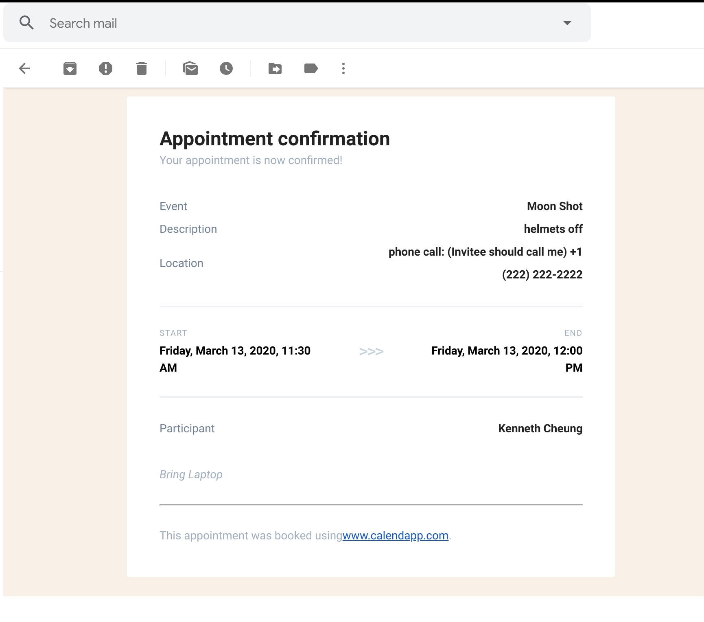

# CalendApp

## Table of Contents
* [Technologies Used](https://github.com/hatchways/team-matcha#technologies)
* [Overview](https://github.com/hatchways/team-matcha#overview)
* [Running Locally](https://github.com/hatchways/team-matcha#to-run)

## Technologies

* Python (*Flask*), Javascript (*ReactJs*), Postgres (*SqlAlchemy*), CSS (*Materials-UI*)

## Overview

CalendApp is an appointment scheduling application inspired by [Calendly.com](https://calendly.com/).
The application provides a dashboard to manage events, appointments, and availability settings. When 
a you are ready to send out invitation simply share the event's unique url to provide access to the 
calendar view with available time slots. The calendar system features integration with the users 
Google Calendar to block off unavailable timeslots. The system is also timezone aware so everyone 
is on the same page. Upon successful booking of an appointment the application will send a 
confirmation email to you. Both parties will have google calendar event invitiations created.

### Onboarding

#### Features
* Login with Google Oauth
* Set user unique url suffix and timezone
* Set first event's availability (time and days)


*onboarding flow*

### Events

#### Features
* Create, Read, Update, Delete Event
* Specify
  * Name, location or phone number, description, unique event link suffix, duration, timezone, available days, and color
* Each event has a unique sharable link to provide invitees access to a calendar of available time slots


*event creation flow*


### Calendar and Appointments
#### Features

* Calendar provides available timeslots for booking a meeting time
* Timeslots take into account:
  * Google Calendar Events
  * Aplication's database of appointments
  * Event's availability settings
* Timezone picker with corresponding timeslot times
* Optional Comment on the booking by invitee

*calendar flow*


*appointments view*

### Email Confirmation
#### Features
* User receives email confirmation on successful appointment booking
* Email displays
  * Event Details (name, description, location, etc)
  * Appointment Details (date and time)
  * Event has link that redirects to application


*email confirmation*

## To-Run

### Prerequisite

Docker installed. See [here]('https://www.docker.com/products/docker-desktop')

### Docker

#### Some Useful Commands

#### To build and Run:
```
make docker-build
make docker-up
```
#### To run tests
###### container should be up before testing
```
make docker-test
```

#### To Create Table:
```
make docker-recreate-db
```

#### To enter postgres terminal:
###### docker exec [service name] psql --username=[postgres username] --dbname=[database name]

```
docker-compose exec postgres-db psql --username=postgres --dbname=db_dev
```

